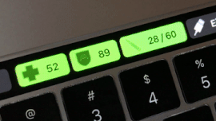

# WIP Touch Bar Counter-Strike: Global Offensive HUD

Work in progress...

Touch Bar Counter-Strike: Global Offensive HUD shows health, armor and ammo in your touch bar. For now it needs Node.js proxy server to run in background.

## How to install

1. Install [BetterTouchTool](https://www.boastr.net/)
2. install [Node.js](https://nodejs.org/en/)
3. pull this repo contents
4. install proxy dependencies `cd ./proxy && npm install`
5. open BetterTouchTool/Configuration/Touch Bar and import `.bttpreset` file
6. BetterTouchTool/Settings/BTT Scriptiong set Shared Secret for Scripting to `9iKfnw5xvy0tY0mZdow6fBwkINykYLQw` (or change `shared_secret` in `./proxy/server.js` if you want to use your own)
7. copy config to Counter-Strike: Global Offensive dir `cp cfg/gamestate_integration_consolesample.cfg /Users/$USER/Library/Application Support/Steam/steamapps/common/Counter-Strike Global Offensive/csgo/cfg/gamestate_integration_consolesample.cfg` to enable date streaming

## Testing

1. Run proxy server `cd ./proxy && npm start` - server will listen on `127.0.0.1:2746`
2. run Counter-Strike: Global Offensive
3. join the game, after first shot or hit Touch Bar buttons will init and start updating

## Authors

* [Marek Kaczkowski](https://github.com/marekkaczkowski)

## License

Touch Bar Counter-Strike: Global Offensive HUD is published under the [MIT License](http://www.opensource.org/licenses/mit-license.php).

